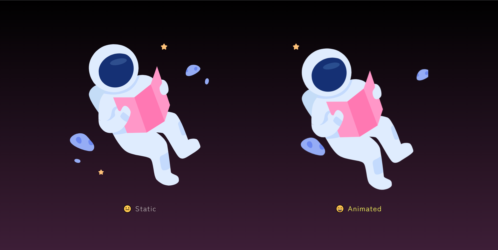

<h1 align="center">👨‍🚀 Astronaut SVG Animation</h1>

<ul>
<li><a href="#english-documentation">English documentation</a></li>
<li><a href="#documentação-em-português">Documentação em português</a></li>
</ul>

<h1 id="english-documentation">English Documentation</h1>
<h2>📜 Table of content</h2>

<!--ts-->
<ul>
    <li><a href="#about-the-project">About the project</a></li>
    <li><a href="#front-end">Front-end</a></li>
    <ul>
        <li><a href="#layout">Layout</a></li>
        <li><a href="#technologies-front">Technologies</a></li>
    </ul>
    <li><a href="#inspirations">Inspirations</a></li>
    <li><a href="#live-demo">Live demo</a></li>
    <li><a href="#author">Author</a></li>
</ul>
<!--te-->

<h2 id="about-the-project">💻 About the project</h2>

I made this project just because I was in the mood of doing animations. As I really liked the final product, I decided to publish it on GitHub. With the illustration beign animated, it will give a nice touch on a website banner or in a 404 page.

<h2 id="front-end">Front-end</h2>

The front-end was built with HTML and CSS only, you can check below how the project look like (at the end of this documentation you can check a <a href="#live-demo">live version</a>):

<h3 id="layout">📐 Layout</h3>

    

<h3 id="technologies-front">🔨 Technologies</h3>

The following techlogies were used to build Astronaut SVG Animation:

<ul>
<li>HTML</li>
<li>CSS</li>
</ul>
<h3 id="inspirations">😁 Inspirations</h3>

The astronaut&#39;s SVG was taken from:

<ul>
<li><a href="https://www.figma.com/community/file/1015219633030143857">404 Illustration Card With Cool Caption, by Abell Vo</a></li>
</ul>
<h3 id="live-demo">🌐 Live demo</h3>

Check a live demo <a href="https://6r3nu.csb.app/">here</a>

<h3 id="author">👩‍🦲 Author</h3>

Developed by <strong>Matheus do Livramento</strong>.

<a href="https://github.com/livramatheus">GitHub</a> | <a href="https://www.linkedin.com/in/livramatheus">LinkedIn</a>

<h1 id="documentação-em-português">Documentação em português</h1>
<h2>📜 Tabela de conteúdo</h2>

<!--ts-->
<ul>
    <li><a href="#about-the-project-br">Sobre o projeto</a></li>
    <li><a href="#front-end-br">Front-end</a></li>
    <ul>
        <li><a href="#layout-br">Layout</a></li>
        <li><a href="#technologies-front-br">Tecnologias</a></li>
    </ul>
    <li><a href="#inspirations-br">Inspirações</a></li>
    <li><a href="#live-demo-br">Live demo</a></li>
    <li><a href="#autor-br">Autor</a></li>
</ul>
<!--te-->

<h2 id="about-the-project-br">💻 Sobre o projeto</h2>

Fiz este projeto porque estava com vontade de fazer animações. Como gostei muito do resultado final, resolvi publicá-lo no GitHub. Como a ilustração é animada, ela dará um toque bacana em um banner de um site ou em uma página 404.

<h2 id="front-end-br">Front-end</h2>

O front-end foi construído apenas com HTML e CSS, você pode verificar abaixo como é o projeto (no final desta documentação você pode verificar uma <a href="#live-demo-br">versão ao vivo</a>):

<h3 id="layout-br">📐 Layout</h3>

    

<h3 id="technologies-front-br">🔨 Tecnologias</h3>

As seguintes tecnologias foram usadas para construir a animação SVG do astronauta:

<ul>
<li>HTML</li>
<li>CSS</li>
</ul>
<h3 id="inspirations-br">😁 Inspirações</h3>

O SVG do astronauta foi pego de:

<ul>
<li><a href="https://www.figma.com/community/file/1015219633030143857">404 Illustration Card With Cool Caption, por Abell Vo</a></li>
</ul>
<h3 id="live-demo-br">🌐 Live demo</h3>

Veja este projeto rodando <a href="https://6r3nu.csb.app/">aqui</a>

<h3 id="autor-br">👩‍🦲 Author</h3>

Desenvolvido por <strong>Matheus do Livramento</strong>.

<a href="https://github.com/livramatheus">GitHub</a> | <a href="https://www.linkedin.com/in/livramatheus">LinkedIn</a>

